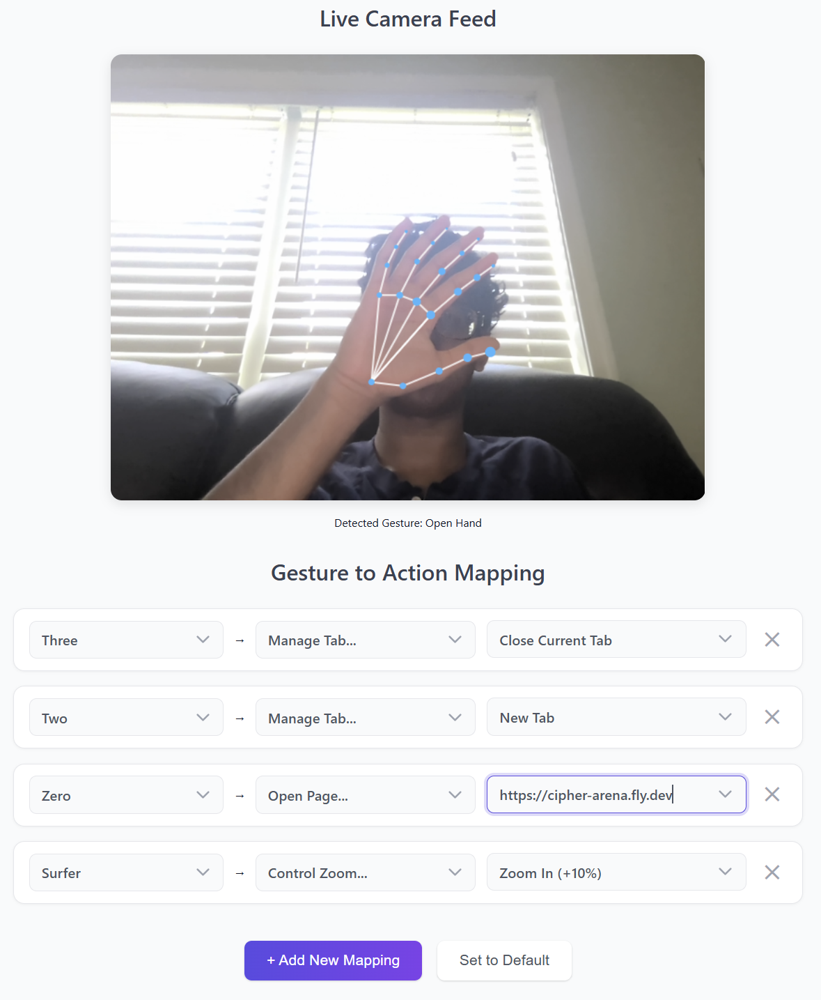
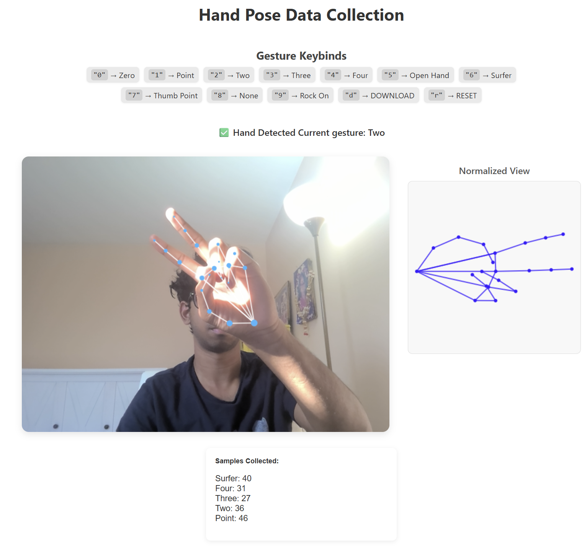

# Edwin IO

Turn yourself into Tony Stark with **Edwin IO**, the Chrome extension that brings futuristic, hands free control to Google Chrome. Named after Howard Stark's butler, Edwin Jarvis, this extension allows you to command your browser with simple hand gestures detected through your webcam. Effortlessly scroll, click, and navigate the web, all without touching your mouse or keyboard.

## Installation

The extension has not been published yet on the Chrome Web Store. However, you can easily install it for development and personal use by following these steps:

1.  **Download the Extension:** Download the latest release from the **[Edwin IO Download Repository](https://github.com/KashGiannis34/Edwin-IO-Download)**. Click the `Code` button and select `Download ZIP`.
2.  **Unzip the File:** Unzip the downloaded folder.
3.  **Open Chrome Extensions:** Open Google Chrome and navigate to `chrome://extensions`.
4.  **Enable Developer Mode:** In the top right corner, turn on the "Developer mode" toggle.
5.  **Load the Extension:** Click the "Load unpacked" button and select the unzipped folder you downloaded in step 2.

The Edwin IO icon should now appear in your Chrome toolbar, ready to use\!

## Features

  * **Real time Gesture Recognition:** Uses a custom TensorFlow.js model to instantly recognize 10 different hand gestures.
  * **Intelligent Gesture Filtering:** Includes a dedicated **"No Gesture"** class, which is crucial for reducing false positives. This prevents the extension from triggering actions when the user is not actively gesturing (ex: when their hand is holding their phone, resting on their face, etc).
  * **Comprehensive Browser Control:**
      * **Page Interaction:** Scroll the page by a percentage, go back/forward in history, reload the page, and control the zoom level.
      * **Tab Management:** Create, close, duplicate, pin, and unpin tabs.
      * **Tab Navigation:** Switch to the next or previous tab, move a tab's position (left, right, start, end), or jump to a specific tab by searching for its title or URL.
      * **Media Control:** Mute, unmute, or toggle the audio of the current tab.
  * **Customizable Action Mapping:** Use the intuitive dashboard to map any of the 10 supported gestures to any available browser action, creating a personalized experience.
  * **Privacy Focused:** All gesture recognition and data processing happens entirely on your local machine. Your camera feed never leaves your computer.

-----
# Development

## [Data Collection Pipeline](./gesture-model-pipeline/data-collection/)

The data collection process for Edwin IO was built around a separate **[custom Chrome extension](./gesture-model-pipeline/data-collection/)** designed to capture and label hand gesture data efficiently and accurately. The pipeline consists of the following steps:

- **Webcam Capture and Hand Pose Detection:** The extension uses TensorFlow.js’s hand-pose-detection model to extract 21 keypoints from the user’s hand in real time.
- **Keypoint Normalization:** Each set of keypoints is normalized through translation (centering the wrist at the origin), rotation (aligning the palm direction), and scaling (standardizing hand size). This ensures gesture data is consistent regardless of hand position, orientation, or user.
- **Interactive Labeling:** Users label gestures by pressing keyboard shortcuts, instantly saving the normalized keypoints with the corresponding gesture label. The extension supports rapid switching between gesture classes and provides real time feedback on sample counts.
- **Data Export:** Collected samples can be downloaded as JSON files for further processing and model training.

This pipeline enabled the collection of approximately 67,000 labeled samples across 10 gesture classes, including a dedicated "No Gesture" class to reduce false positives. It was also used to generate a separate test set of approximately 20,000 samples used for model evaluation.

## [Custom Gesture Model](./gesture-model-pipeline/build-model)

The core of Edwin IO’s gesture recognition is a custom neural network trained on the collected and normalized hand pose data. The model development process includes:

- **Model Architecture:** The network consists of an input layer (42 features), two hidden layers (64 neurons each, ReLU activation, 20% dropout), and a softmax output layer for 10 gesture classes.
- **Training:** The model is trained using TensorFlow.js for Node.js, with dropout layers to prevent overfitting.
- **Evaluation:** On a test set of around 20,000 samples, the model achieved an overall accuracy of 93.7%. Precision and recall are high for most gestures, with the "No Gesture" class being the most challenging. The most common misclassification is between visually similar gestures, such as "Surfer" and "Thumb Point."

**Classification Report (excerpt):**
| Gesture Class  |  Precision | Recall |
|----------------|------------|--------|
|Rock On         | 1.000      | 0.976  |
|Two             | 1.000      | 0.964  |
|Surfer          | 1.000      | 0.729  |
|Point           | 0.995      | 1.000  |
|Open Hand       | 0.987      | 0.943  |
|Four            | 0.957      | 0.982  |
|Circle (Zero)   | 0.945      | 1.000  |
|Three           | 0.944      | 0.923  |
|Thumb Point     | 0.804      | 0.955  |
|No Gesture      | 0.800      | 0.893  |

The trained model is integrated into the Edwin IO Chrome extension and powers real time gesture recognition and browser control.

-----

For a complete analysis of the custom gesture model’s performance, including a full confusion matrix, ROC curves, and confidence analysis, please see the full technical report:

**[View the Full Model Evaluation Report (PDF)](./Edwin_IO_Custom_Gesture_Model_Report.pdf)**